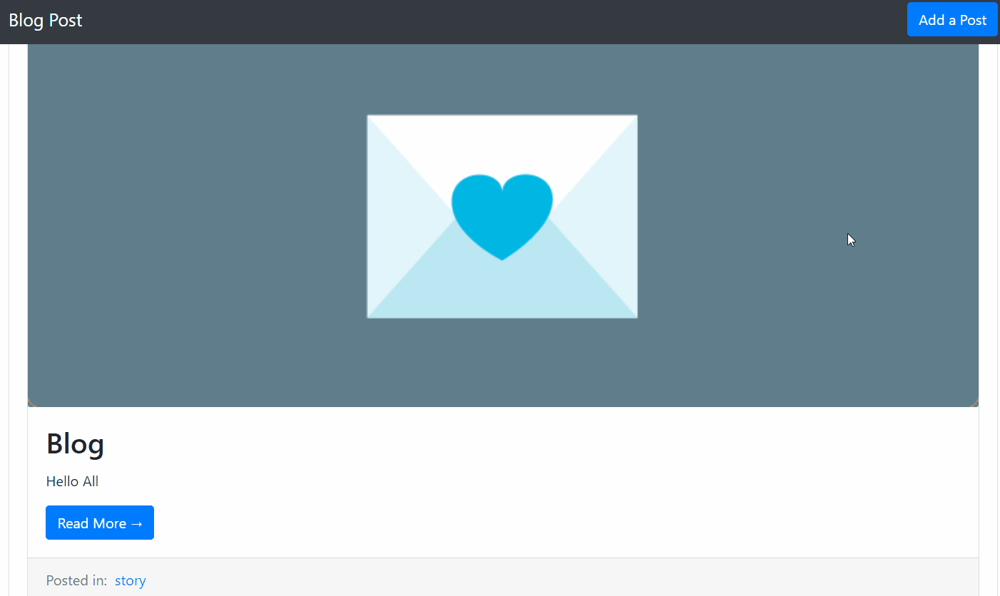

# Youtube Services with ReactJS.

This is a Blog Posts app, is made with ReactJS and Redux.



You can see this alive, [Click here](http://frozen-oasis-51444.herokuapp.com/).

This Project is part of the Udemy course - Modern React with Redux by Stephen Grider

## Getting Started

Click in the download button and get the .zip file. Extract the contents of the zip file.

Or can clone this repository, just copy the git url and open your terminal and run git clone + repository url:

```
git clone https://github.com/ejgdev/blog-posts-react-redux.git
```

### Prerequisites

It is necessary to have installed a package manager like npm or yarn.

- [NodeJS website](https://nodejs.org/).
- [Yarn website](https://yarnpkg.com/).

In this time, this app use the Stephen Grider's Api server, that he created for the course; also uses the `API_KEY` by default.

- PAPERCLIP1234

You can use your own `API_KEY`, just put an unique string in `./src/actions/index.js`.

Another option, you can use you own Api server that can be change in the same file before.

### Installing

For install this repository, just need to run this command:

```
npm install
```
### Optional

This project have configured a linter, just need installed a linter package in your text code editor.

In atom you can use this [package](https://atom.io/packages/linter-eslint).

### Start the Project
When everything is setup, you can run the project with this command:

```
npm start
```
Then open http://localhost:3000/ to see your app. By default run on port 3000.

## Deployment

There are differents way to Deployment.

If you want use Heroku, you can follow this [article](https://devcenter.heroku.com/articles/git).

When your heroku app is created, just need deploy with this command:

```
git push heroku master
```
